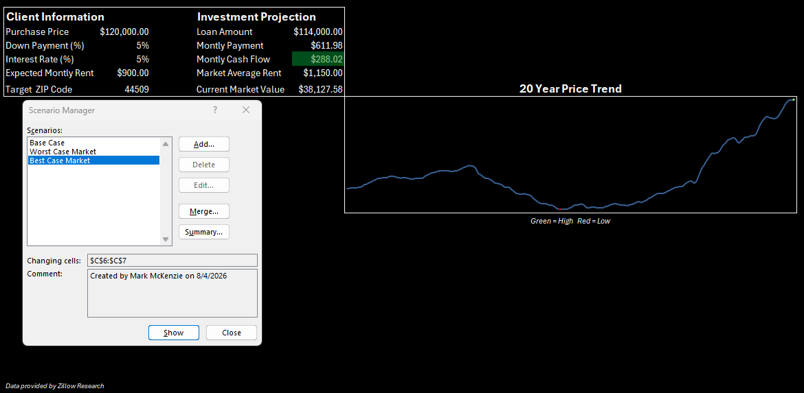
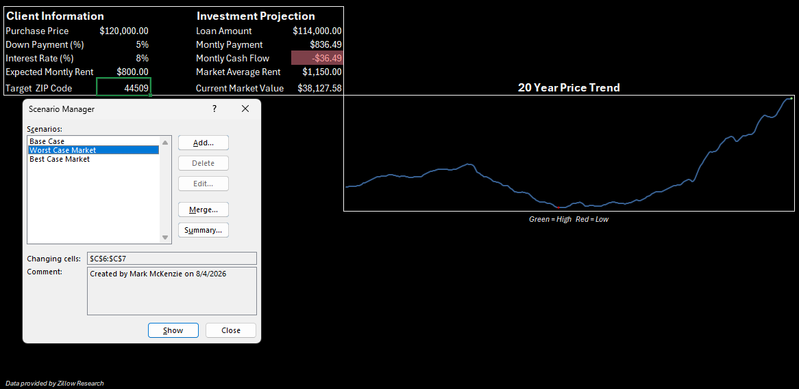
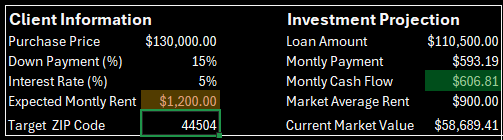

# Real Estate Investment ROI Calculator & Market Analysis
### Standardizing Real Estate Acquisitions for Vanguard Property Group

---

## Table of Contents
- [Executive Summary](#executive-summary)
- [Business Problem](#business-problem)
- [Solution & Methodology](#solution--methodology)
- [Key Skills Showcased](#key-skills-showcased)
- [Final Dashboard](#final-dashboard)

---

## Executive Summary
* I created an interactive Excel dashboard that helps a real estate investment firm assess single-family rental properties. The tool created, combines custom financial modeling and historical market data to project 10 year returns. To ease aquistion risk. 
---

## Business Problem
Currently, Vanguard's acquisition managers are evaluating potential properties using inconsistent math and disjoined, static spreadsheets. Because they lack a standardized tool, they struggle to objectively compare properties across different ZIP codes, occasionally leading to risky investments that fail to account for historical market stagnation.

Vanguard needs a dynamic, data-driven tool to standardize their property vetting process and accurately project a 10 year ROI based on historical ZIP code data.

> **View the full Business Requirements Document (BRD) [here](business_requirments_document.md)**

---

## Solution & Methodology

### 1. Data Extraction & Cleaning
* Pulled in **Zillow Home Value Index (ZHVI)** and **Zillow Observed Rent Index (ZORI)** CSVs from Zillow Research Data.
* Used **Power Query** to filter by target states and unpivot data columns into a clean, normalized,  "long" format automating the ETL process.

### 2. Financial Calculator
* Created a hidden calculation sheet using financial functions like `=PMT()` to calculate accurate debt service.
* Mapped out a live monthly cash flow projection based user inputs like purchase price, down payment, and interest rate.

### 3. Analytics
* Built `=XLOOKUP()` formulas with built-in error handling (`[if_not_found}`) to instantly fetch local market data based on the user's Target ZIP Code.
* Integrated `=FILTER()` dynamic array to extract 20+ years of historical data for dynamic sparkline visualizations.

### 4. Scenario Stress Testing
* Set up a **What-If Analysis & Scenario Manager** to allow the firm to toggle between and evaluate "Base Case", "best Case", and "Worst Case" housing market scenarios.
---

## Key Skills Showcased
* **ELT and Data Normalization** (Power Query)
* **Advanced Excel Functions** (`XLOOKUP`, `PMT`, `FILTER`)
* **Data Validation and Sheet Protection** (UI/UX locking)
* **Data Visualization** (Sparklines and Conditional Formatting)
* **Financial Modeling and Scenario Manager**
---

## Final Dashboard
The **Base Case** shows a middle point interest rate to show the expected monthly cash flow after expected monthly rent has been input and monthly payments has been calculated.

---
The **Best Case** shows the investment projection with a lower interest rate at 5%. 

---
The **Worst Case** shows investment projections with a higher interest rate at 8%. Along with the ability to show bad investments with filtered projections. In this example the expected monthly rent is lower that the market average and cause a negative monthly cash flow.

---
Another filter shows if expected rent monthly rent exceeds the market average rent. Cautioning users if ideal rent is above the market threshold.

---

