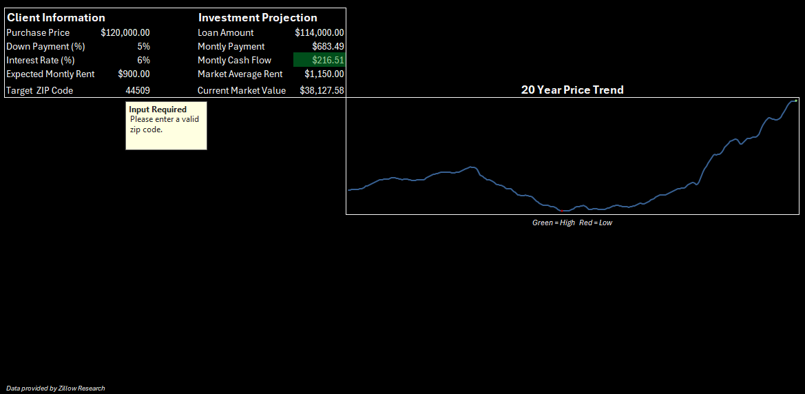

# Real Estate Investment ROI Calculator & Market Analysis
### Standardizing Real Estate Acquisitions for Vanguard Property Group

---

## Table of Contents
- [Executive Summary](#executive-summary)
- [Business Problem](#business-problem)
- [Solution & Methodology](#solution--methodology)
- [Key Skills Showcased](#key-skills-showcased)
- [Final Dashboard](#final-dashboard)

---

## Executive Summary
* I created an interactive Excel dashboard that helps a real estate investment firm assess single-family rental properties. The tool created, combines custom financial modeling and historical market data to project 10 year returns. To ease aquistion risk. 
---

## Business Problem
Currently, Vanguard's acquisition managers are evaluating potential properties using inconsistent math and disjoined, static spreadsheets. Because they lack a standardized tool, they struggle to objectively compare properties across different ZIP codes, occasionally leading to risky investments that fail to account for historical market stagnation.

Vanguard needs a dynamic, data-driven tool to standardize their property vetting process and accurately project a 10 year ROI based on historical ZIP code data.

> **View the full Business Requirements Document (BRD) [here](business_requirments_document.md)**

---

## Solution & Methodology

### 1. Data Extraction & Cleaning
* Pulled in **Zillow Home Value Index (ZHVI)** and **Zillow Observed Rent Index (ZORI)** CSVs from Zillow Research Data.
* Used **Power Query** to filter by target states and unpivot data columns into a clean, normalized,  "long" format automating the ETL process.

### 2. Financial Calculator
* Created a hidden calculation sheet using financial functions like `=PMT()` to calculate accurate debt service.
* Mapped out a live monthly cash flow projection based user inputs like Purchase Price, Down Payment, and Interest Rate.

### 3. Analytics
* Built `=XLOOKUP()` formulas with built-in error handling (`[if_not_found}`) to instantly fetch local market data based on the user's Target ZIP Code.
* Integrated `=FILTER()` dynamic array to extract 20+ years of historical data for dynamic sparkline visualizations.

### 4. Scenario Stress Testing
* Set up a **What-If Analysis & Scenario Manager** to allow the firm to toggle between and evaluate "Base Case", "best Case", and "Worst Case" housing market scenarios.
---

## Key Skills Showcased
* **ELT and Data Normalization** (Power Query)
* **Advanced Excel Functions** (`XLOOKUP`, `PMT`, `FILTER`)
* **Data Validation and Sheet Protection** (UI/UX locking)
* **Data Visualization** (Sparklines and Conditional Formatting)
* **Financial Modeling and Scenario Manager**
---

## Final Dashboard

> The **Base Case** shows a middle point interest rate to show the Expected Monthly Cash Flow after Expected Monthly Rent has been input and Monthly Payments has been calculated. Along with a sparkline visual to show a 20 year trend of housing values with a green and red point to show the high and low over that time.
---
 
### Best Case

> The **Best Case** shows the Investment Projection with a lower interest rate at 5%.
---
### Worst Case

> The **Worst Case** shows Investment Projections with a higher interest rate at 8%. Along with the ability to show bad investments with filtered projections. In this example the Expected Monthly Rent is lower than the Current Market Average and cause a negative Monthly Cash Flow.
---

### Over Market Value

> Another filter shows if Expected Monthly Rent exceeds the market average rent. Cautioning users if ideal rent is above the market threshold.
---

## Workbook Instructions
The ROI Analysis workbook is viewable through the link presented below, due to exceeding the maximum upload size within GitHub. The link will show the Users' UI. To view complete workbook, download the file and unhide the 'Calculator', 'Buy_Home', and 'Rental_Home' tabs.

> [Real Estate ROI Calulator](https://1drv.ms/x/c/9afc337cec36f324/IQCtkZJYbbU7T5ZgFmkKyzxlATOiuabANe223c9no--7Zvs?e=hnrXuW)
